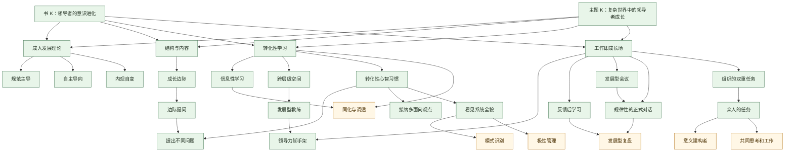

# K卡N卡总表

## 这份总表解决什么
- 把 8 章资产收敛成一套最小可用的 `K / N` 卡骨架。
- 先做概念去重，再决定哪些卡直接复用、哪些值得单独长出来。
- 把“书内逻辑”翻译成“卡片路由”，方便后续继续扩成 `K` 卡、`N` 卡、课程页和内容页。

## 去重原则
1. 已有卡如果定义精度足够，就直接复用，不重复立卡。
2. 只是对比项、动作项、子模块的概念，先挂到上位卡，不急着拆独立卡。
3. 如果现有卡过宽，而这本书对该概念给出了更强的判断价值，就单独立新卡。
4. 组织场景里的动作，优先挂到 `工作即成长场` 这类上位概念下，而不是碎成一堆孤立技巧卡。

## 总收敛结论
- 已有锚点 `K` 卡：`2`
- 已创建第一批 `K` 卡：`4`
- 已有主干 `N` 卡：`8`
- 已创建第一批 `N` 卡：`6`
- 本轮从二级概念继续拆出的 `N` 卡：`8`
- 仍建议先挂在上位卡下、下一批再考虑独立的候选概念：`6`

## 一、K 卡总表
| 卡名                                                                                                 | 状态   | 角色      | 来源章节  | 去重结论   | 说明                               |
| -------------------------------------------------------------------------------------------------- | ---- | ------- | ----- | ------ | -------------------------------- |
| [[领导者的意识进化]]                        | 已有   | 书 K 锚点  | 全书    | 保留     | 负责整本书的主线、总判断和入口路由                |
| [[复杂世界中的领导者成长]]                 | 已有   | 主题 K 锚点 | 1-8 章 | 保留     | 负责跨书主题聚合与复用                      |
| [[领导力瓶颈不在技能，而在心智复杂度]]     | 已创建  | 观点 K    | 1、2、7 | 新增独立卡  | 最适合承接“为什么优秀管理者一进复杂环境就失灵”         |
| [[从结构判断到成长支持：如何找到成长边际]] | 已创建  | 方法 K    | 3、4   | 新增独立卡  | 串联 `结构与内容`、`成长边际`、`边际提问`、`发展型教练` |
| [[为什么很多培训回到工作里人却没变]]       | 已创建  | 机制 K    | 5、6   | 新增独立卡  | 串联 `转化性学习`、`跨层级空间`、`转化性心智习惯`     |
| [[工作现场如何变成发展容器]]               | 已创建  | 组织 K    | 7、8   | 新增独立卡  | 串联 `工作即成长场`、`反馈后学习`、`发展型会议`      |
| 三种心智习惯如何把偶发成长变成持续升级                                                                                | 二级候选 | 习惯 K    | 6     | 先挂上位 K | 先挂在“[[为什么很多培训回到工作里人却没变]]”之下          |
| 反馈为什么不该只是纠错，而该变成共同学习                                                                               | 二级候选 | 场景 K    | 7、8   | 先挂上位 K | 先挂在“[[工作现场如何变成发展容器]]”之下              |

## 二、N 卡主干总表
### 1. 直接复用的已有 N 卡
| 卡名 | 状态 | 来源章节 | 为什么保留 | 挂接 K |
|---|---|---|---|---|
| [[成人发展理论]] | 已有 | 1、2 | 全书总框架，不能去掉 | 书 K / 主题 K |
| [[规范主导]] | 已有 | 2 | 三种核心结构之一，已够稳定 | 书 K |
| [[自主导向]] | 已有 | 2 | 三种核心结构之一，已够稳定 | 书 K |
| [[内观自变]] | 已有 | 2、6 | 三种核心结构之一，也是后续习惯与系统视角的关键上位概念 | 书 K / 主题 K |
| [[结构与内容]] | 已有 | 1、3 | 这是全书最关键的诊断转向 | 书 K / 方法 K |
| [[成长边际]] | 已有 | 3、4 | 是从判断走向支持的核心抓手 | 方法 K |
| [[转化性心智习惯]] | 已有 | 6 | 已可作为三种习惯的上位卡 | 机制 K |
| [[工作即成长场]] | 已有 | 7、8 | 已足以承接组织级落地逻辑 | 组织 K / 主题 K |

### 2. 已创建的第一批 N 卡
| 卡名 | 状态 | 来源章节 | 为什么值得独立立卡 | 挂接位置 |
|---|---|---|---|---|
| [[转化性学习]] | 已创建 | 5 | 这是第 5 章的核心分水岭，现有卡里没有等价概念 | 机制 K |
| [[跨层级空间]] | 已创建 | 5 | 直接决定课程 / 培训 / 工作坊为什么对不同人效果不同 | 机制 K |
| [[发展型教练]] | 已创建 | 4 | 现有泛“教练”类卡不够贴合这本书的结构导向 | 方法 K |
| [[边际提问]] | 已创建 | 3、4、6 | 现有 提问力 太泛，这本书强调的是“沿[[成长边际]]提问” | 方法 K |
| [[反馈后学习]] | 已创建 | 7 | 现有 反馈 太宽，不足以承接本书对反馈的重写 | 组织 K |
| [[发展型会议]] | 已创建 | 8 | 这是把“[[工作即成长场]]”做实的高频组织装置，值得独立 | 组织 K |

### 3. 本轮从二级概念继续拆出的 8 张 N 卡
| 卡名 | 状态 | 来源章节 | 为什么现在值得独立立卡 | 挂接位置 |
|---|---|---|---|---|
| [[信息性学习]] | 已创建 | 5 | 它不再只是 `转化性学习` 的对照注脚，而是区分学习类型的关键判断卡 | 机制 K |
| [[提出不同问题]] | 已创建 | 6 | 它更偏“问题框架升级”，可以和 `边际提问` 的动作层稳定分开 | 方法 K / 机制 K |
| [[接纳多面向观点]] | 已创建 | 6 | 它在协作、反馈和冲突处理中已具备独立调用价值 | 主题 K / 机制 K |
| [[看见系统全貌]] | 已创建 | 6 | 它已经足够承担系统观察与复盘的独立判断，不必再只挂在上位卡下 | 主题 K / 组织 K |
| [[领导力脚手架]] | 已创建 | 4、8 | 它补出了“成长支持”与“组织承接”之间的支撑层 | 方法 K / 组织 K |
| [[组织的双重任务]] | 已创建 | 8 | 它是组织级原则卡，足以从 `工作即成长场` 中独立承担判断 | 组织 K |
| [[众人的任务]] | 已创建 | 8 | 它把“领导者的发展任务”翻译成“工作共同体的共同任务” | 组织 K |
| [[规律性的正式对话]] | 已创建 | 8 | 它补出了 `发展型会议` 之外的正式对话节奏与装置层 | 组织 K |

### 4. 仍建议先挂上位卡、下一批再考虑独立的候选概念
| 概念 | 当前处理方式 | 先挂到哪里 | 为什么暂时不急着独立 |
|---|---|---|---|
| 同化与调适 | 候选机制卡 | `转化性学习` / `信息性学习` | 很重要，但当前更多承担学习机制解释，先不把卡网拆得太细 |
| 意义建构者 | 候选前提卡 | `众人的任务` / `组织的双重任务` | 它是第 8 章的重要前提，但暂时更适合作为组织协作的人性基础概念 |
| 模式识别 | 候选方法卡 | `看见系统全貌` | 当前先作为系统观察的具体动作，不急着独立 |
| 极性管理 | 候选方法卡 | `看见系统全貌` / `工作即成长场` | 它适合作为系统张力的下一层方法卡，当前先挂上位卡即可 |
| 共同思考和工作 | 候选协作卡 | `众人的任务` / `规律性的正式对话` | 它是组织动作方向，但目前还更适合作为共同任务的展开节点 |
| 发展型复盘 | 候选场景卡 | `反馈后学习` / `规律性的正式对话` | 它有独立潜力，但和 `反馈后学习`、`发展型会议` 的边界还不够清楚 |

### 5. 已有泛概念卡的使用方式
| 现有卡 | 处理方式 | 原因 |
|---|---|---|
| 反馈 | 保留为跨书泛卡 | 继续保留，但不直接承担这本书的专属判断 |
| 提问力 | 保留为旁支卡 | 可作为“问题推动思考”的泛入口，但不代替 `边际提问` |
| 领导者成长 | 保留为跨书背景卡 | 这张卡太宽，不适合承担本书的精确概念路由 |

## 三、最小可用卡组
### 1. 当前就能跑起来的骨架
- `K`： [[领导者的意识进化]] + [[复杂世界中的领导者成长]]
- `N`： [[成人发展理论]] / [[规范主导]] / [[自主导向]] / [[内观自变]] / [[结构与内容]] / [[成长边际]] / [[转化性心智习惯]] / [[工作即成长场]]

### 2. 已补齐的 6 张 N 卡
1. [[转化性学习]]
2. [[跨层级空间]]
3. [[发展型教练]]
4. [[边际提问]]
5. [[反馈后学习]]
6. [[发展型会议]]

### 3. 已补齐的 4 张 K 卡
1. [[领导力瓶颈不在技能，而在心智复杂度]]
2. [[从结构判断到成长支持：如何找到成长边际]]
3. [[为什么很多培训回到工作里人却没变]]
4. [[工作现场如何变成发展容器]]

## 四、挂接关系图

## 五、从章节资产到卡片的映射
- [[第一章 心智的层次]]
  对应：`成人发展理论`、书 K 主问题
- [[第二章 深入分析心智结构]]
  对应：`规范主导`、`自主导向`、`内观自变`
- [[第三章 寻找成长的边际]]
  对应：`结构与内容`、`成长边际`、`边际提问`
- [[第四章 扩展式的成长教练]]
  对应：`发展型教练`、`领导力脚手架`
- [[第五章 专业发展的蜕变]]
  对应：`转化性学习`、`信息性学习`、`跨层级空间`
- [[第六章 具转化性的心智习惯]]
  对应：`转化性心智习惯`、`提出不同问题`、`接纳多面向观点`、`看见系统全貌`
- [[第七章 孕育领导力]]
  对应：`反馈后学习`、领导力相关 K 卡
- [[第八章 孕育智慧]]
  对应：`工作即成长场`、`组织的双重任务`、`众人的任务`、`规律性的正式对话`、`发展型会议`

## 六、下一步最顺的推进顺序
1. 先从下一批候选里判断 `同化与调适` 与 `意义建构者` 是否继续独立立卡。
2. 再把本轮新增的 8 张 N 卡继续回挂到上位卡正文里，减少“总表已拆、正文还弱”的情况。
3. 最后选 `成长边际`、`工作即成长场`、`组织的双重任务` 这类高频卡，继续收成更偏行动设计的 `P / Project` 页面。

## 站内入口

- [[领导者的意识进化]]
- [[复杂世界中的领导者成长]]
- [[领导力瓶颈不在技能，而在心智复杂度]]
- [[从结构判断到成长支持：如何找到成长边际]]
- [[为什么很多培训回到工作里人却没变]]
- [[工作现场如何变成发展容器]]
- [[成人发展理论]]
- [[主体 - 客体转换]]
- [[规范主导]]
- [[自主导向]]
- [[内观自变]]
- [[结构与内容]]
- [[边际提问]]
- [[发展型教练]]
- [[反馈后学习]]
- [[发展型会议]]
- [[提出不同问题]]
- [[领导力脚手架]]
- [[规律性的正式对话]]
